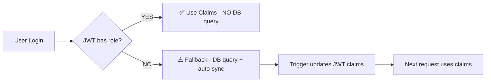

# Custom Claims - JWT Authentication

> **All Stars 2026** - Performance-optimized stateless authentication

## Vue d'ensemble

Le système d'authentification utilise des **custom claims** stockés dans le JWT pour éviter les requêtes DB sur chaque appel API authentifié.

## Architecture

### 1. Synchronisation Automatique (Database Trigger)

```sql
-- Trigger SQL qui synchronise automatiquement User.role → JWT
CREATE TRIGGER on_user_role_change
  AFTER INSERT OR UPDATE OF role, "displayName" ON public.users
  FOR EACH ROW
  EXECUTE FUNCTION sync_user_role_to_jwt();
```

**Fichier** : `prisma/migrations/custom_claims_sync.sql`

### 2. Flow d'authentification



### 3. Structure du JWT

```typescript
{
  // Standard Supabase claims
  sub: "user-uuid",
  email: "user@example.com",

  // ✨ Custom claims (synced by trigger)
  app_metadata: {
    role: "USER" | "ADMIN",        // ← From public.users
    displayName: "John Doe",        // ← From public.users
    provider: "google" | "email"    // ← OAuth provider
  },

  // OAuth user metadata
  user_metadata: {
    full_name: "John Doe",
    avatar_url: "https://..."
  }
}
```

## Performance

| Scénario | DB Query | Performance |
|----------|----------|-------------|
| **Requête normale** (JWT avec claims) | ❌ Non | ⚡ Instantané |
| **Premier login OAuth** | ✅ Oui | 🐢 ~10-50ms |

**Impact** : 99% des requêtes n'ont AUCUNE DB query pour l'auth ✨

## Code

### JwtAuthGuard (apps/api/src/auth/guards/jwt-auth.guard.ts)

```typescript
async canActivate(context: ExecutionContext): Promise<boolean> {
  const supabaseUser = await this.supabaseService.verifyToken(token);

  const hasCustomClaims = !!supabaseUser.app_metadata?.role;

  if (hasCustomClaims) {
    // ✅ OPTIMIZED: Use JWT claims (no DB query)
    request.user = {
      ...supabaseUser,
      dbUser: {
        id: supabaseUser.id,
        role: supabaseUser.app_metadata.role,        // ← From JWT
        displayName: supabaseUser.app_metadata.displayName,
        // ...
      }
    };
  } else {
    // ⚠️ FALLBACK: First login (DB query + auto-sync)
    let dbUser = await this.prismaService.user.findUnique(...);
    if (!dbUser) {
      dbUser = await this.prismaService.user.create(...);
      // → Trigger fires → JWT claims updated
    }
    request.user = { ...supabaseUser, dbUser };
  }
}
```

### Types (apps/api/src/auth/types/request-user.type.ts)

```typescript
export interface AppMetadata {
  role: Role;
  displayName: string;
  provider?: 'google' | 'apple' | 'email';
}

export interface RequestUser extends User {
  app_metadata: AppMetadata;
  dbUser: RequestDbUser;
  authProvider: 'google' | 'apple' | 'email';
}
```

## Utilisation dans les Controllers

```typescript
@Get('profile')
@UseGuards(JwtAuthGuard)
async getProfile(@CurrentUser() user: any): Promise<UserDto> {
  // user.id           ← Supabase User ID
  // user.authProvider ← OAuth provider
  // user.dbUser.role  ← Role from JWT claims (no DB query!)

  return this.authService.getProfile(user.id);
}
```

## Utilisation dans les Guards

```typescript
@Injectable()
export class RolesGuard implements CanActivate {
  canActivate(context: ExecutionContext): boolean {
    const request = context.switchToHttp().getRequest();
    const user = request.user?.dbUser;

    // ✅ user.role comes from JWT claims (no DB query)
    return requiredRoles.includes(user.role);
  }
}
```

## Quand les claims sont-ils mis à jour ?

1. **Création d'utilisateur** : Trigger se déclenche automatiquement
2. **Mise à jour du role** : Trigger se déclenche automatiquement
3. **Mise à jour du displayName** : Trigger se déclenche automatiquement

**Important** : Le JWT actuel ne change pas immédiatement. Les nouveaux claims sont disponibles au prochain **refresh token** ou **re-login**.

## Scénario Premier Login OAuth

1. User clique "Sign in with Google"
2. Supabase Auth crée user → génère JWT **sans custom claims**
3. Frontend envoie JWT à l'API
4. `JwtAuthGuard` détecte absence de claims → **Fallback DB query**
5. `JwtAuthGuard` crée user dans Prisma → **Trigger SQL fire**
6. Trigger met à jour `auth.users.app_metadata`
7. Au prochain refresh token → nouveau JWT **avec custom claims**
8. Toutes les requêtes suivantes utilisent le chemin optimisé ✅

## Migration Effectuée

### Phase 1 : JWT Signing Keys ✅
- Ancien : HS256 (symmetric)
- Nouveau : ES256 (asymmetric)
- Migration effectuée le : 2024-12-XX

### Phase 2 : Custom Claims ✅
- Database trigger créé
- JwtAuthGuard modifié
- Types TypeScript ajoutés
- Migration effectuée le : 2024-12-XX

### Phase 3 : API Keys (en cours)
- Ancien : `anon` / `service_role` (JWT)
- Nouveau : `sb_publishable_...` / `sb_secret_...` (non-JWT)
- Deadline : Novembre 2025

## Monitoring

Pour surveiller le fallback path (cas anormaux) :

```typescript
if (!hasCustomClaims) {
  this.logger.warn(`User missing custom claims`, {
    email: supabaseUser.email,
    createdAt: supabaseUser.created_at,
  });
  // TODO: Send metric to monitoring (DataDog, Sentry)
}
```

## Best Practices

✅ **DO** :
- Utiliser `@CurrentUser()` dans les controllers
- Laisser le guard gérer la synchronisation
- Faire confiance aux claims du JWT

❌ **DON'T** :
- Query DB pour récupérer le role (déjà dans JWT)
- Modifier manuellement `auth.users.app_metadata` (utiliser le trigger)
- Utiliser `request.user` sans passer par `@CurrentUser()`

## Références

- **Database trigger** : `prisma/migrations/custom_claims_sync.sql`
- **Guard** : `apps/api/src/auth/guards/jwt-auth.guard.ts`
- **Types** : `apps/api/src/auth/types/request-user.type.ts`
- **Supabase Docs** : [Custom Claims](https://supabase.com/docs/guides/auth/custom-claims)